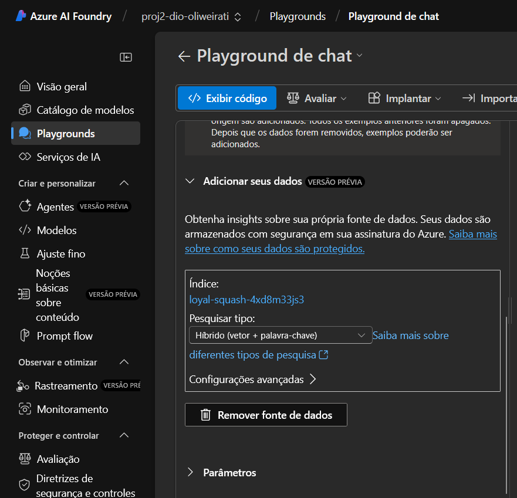
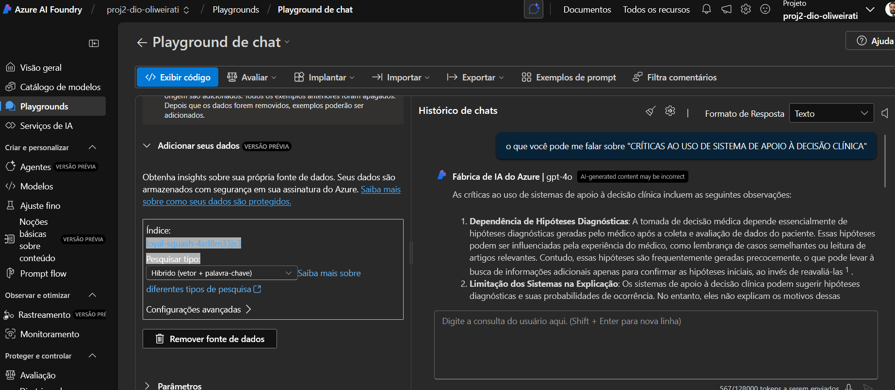
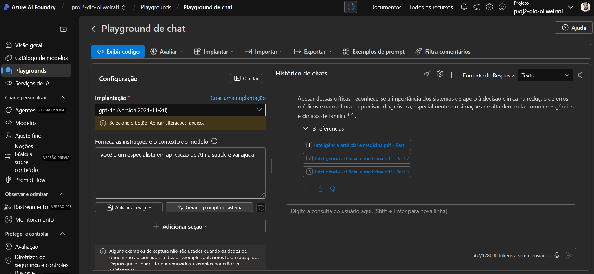
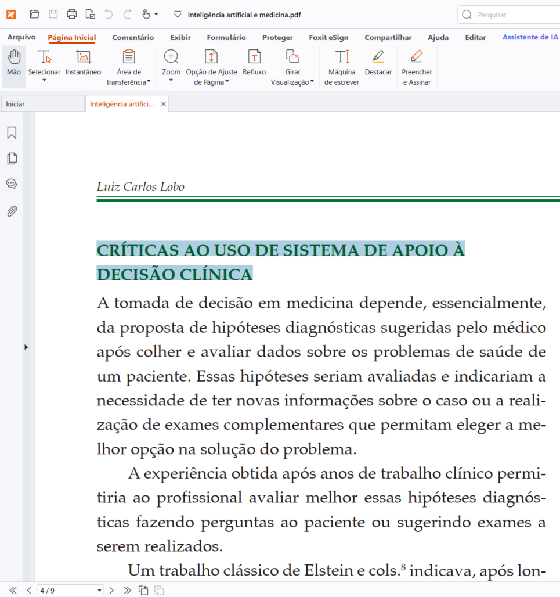

# chat_azure_foundry_ai_dio_-proj2
Chat  criado com o Azure Foundry AI para o segundo projeto do curso de DP-100 da Dio.me

Depois de carregar o artigo "Inteligência artificial e medicina" e gerar o índice "loyal-squash-4xd8m33js3"

Eu consigo perguntar algo que está dentro do artigo que o chat me responderá com o contexto do artigo.

Eu fiz a pergunta para o chat "o que você pode me falar sobre "CRÍTICAS AO USO DE SISTEMA DE APOIO À DECISÃO CLÍNICA?"

E a resposta foi:

As críticas ao uso de sistemas de apoio à decisão clínica incluem as seguintes observações:

    Dependência de Hipóteses Diagnósticas: A tomada de decisão médica depende essencialmente de hipóteses diagnósticas geradas pelo médico após a coleta e avaliação de dados do paciente. Essas hipóteses podem ser influenciadas pela experiência do médico, como lembrança de casos semelhantes ou leitura de artigos relevantes. Contudo, essas hipóteses são frequentemente geradas precocemente, o que pode levar à busca de informações adicionais apenas para confirmar as hipóteses iniciais, ao invés de reavaliá-las 1 .

    Limitação dos Sistemas na Explicação: Os sistemas de apoio à decisão clínica podem sugerir hipóteses diagnósticas e suas probabilidades de ocorrência. No entanto, eles não explicam os motivos dessas hipóteses e fornecem apenas o "know-what" (o que fazer), mas não o "know-why" (por que fazê-lo). Isso pode limitar a capacidade do sistema de auxiliar completamente na tomada de decisão 1 2 .

    Possibilidade de Erros: Esses sistemas dependem da qualidade dos dados fornecidos e da capacidade de interpretar as condições do paciente. Erros podem surgir caso os dados sejam inadequados ou se o sistema não consiga captar nuances específicas da condição do paciente .

    Limitação na Relação Médico-Paciente: O uso excessivo de sistemas pode impactar negativamente a interação entre médico e paciente, já que as máquinas não são capazes de oferecer explicações ou suporte emocional ao paciente. Isso reforça a ideia de que os médicos nunca serão totalmente substituídos pelas máquinas 2 .

Apesar dessas críticas, reconhece-se a importância dos sistemas de apoio à decisão clínica na redução de erros médicos e na melhora da precisão diagnóstica, especialmente em situações de alta demanda, como emergências e clínicas de família 3 2 .

Inteligência artificial e medicina.pdf - Part 1
Inteligência artificial e medicina.pdf - Part 2
Inteligência artificial e medicina.pdf - Part 3

Onde ele pegou do artigo como mostra abaixo:
